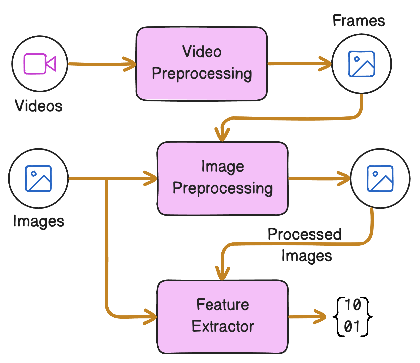
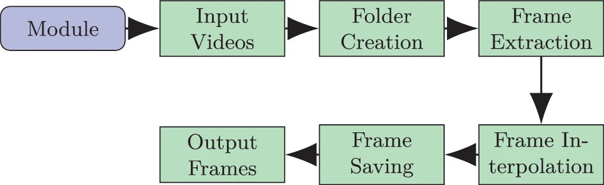
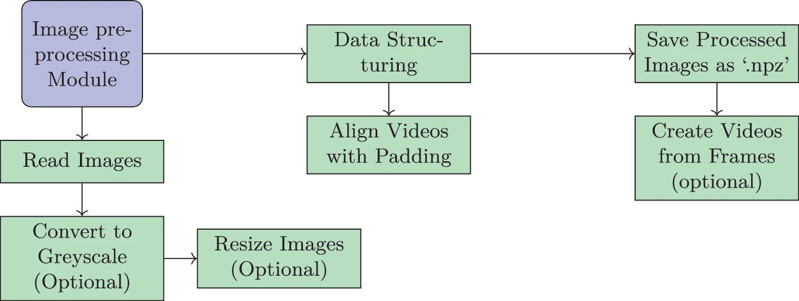
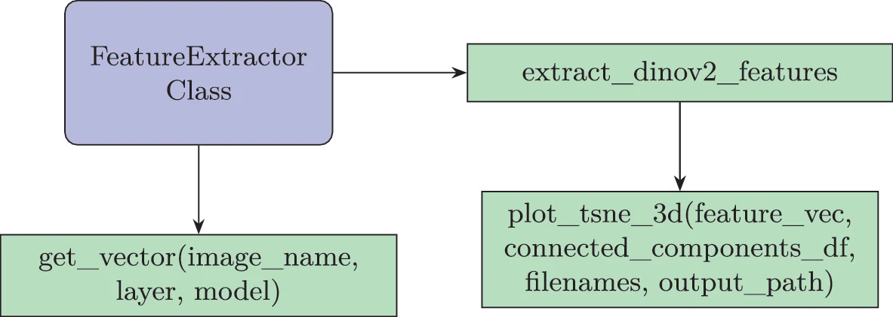
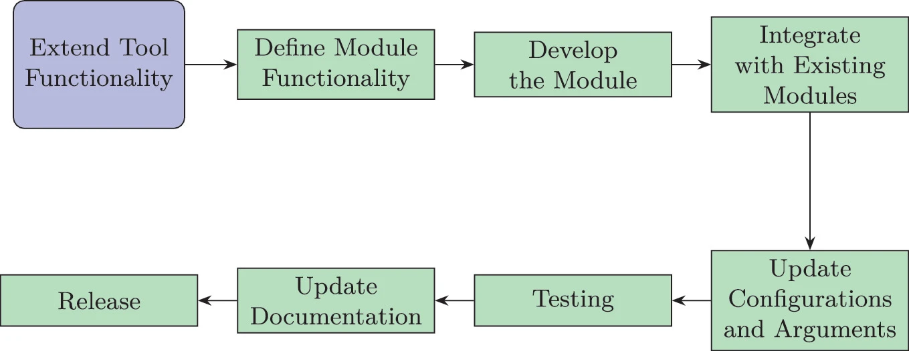

# E2E Video and Image Preprocessing for DL: Domain Independent Pipeline

[](https://www.python.org/downloads/release/python-3816/)
[](https://github.com/simulamet-host/video_analytics/actions/workflows/pytest.yml)
[](https://codecov.io/github/simulamet-host/video_analytics?branch=master)


[](https://github.com/simulamet-host/video_analytics/actions/workflows/pylint.yml)
[](https://github.com/simulamet-host/video_analytics/issues)
[](https://simulamet-host.github.io/video_analytics/e2evideo.html)
 [](https://faiga91.github.io/e2evideo/feature_extractor.html)


## 📖 Description
e2evideo is a versatile Python package designed for video and image pre-processing and analysis 🎥📸. It comprises domain-independent modules that can be customized to suit specific tasks in various fields of computer vision.	



## 🛠️ Installation
To install e2evideo, clone the Git repository, navigate to the directory, and run:
```bash
pip install .
```

# 🚀 Features :
- 🎞️ **Video Pre-processing:** Supports various video formats, frame extraction, and background subtraction.



- 🖼️ **Image Pre-processing:** Converts images to greyscale, resizes images, and structures videos into compressed arrays.



- 🧠 **Feature Extraction:** Includes a pre-trained ResNet18 model and DINOv2 for image embedding extraction.



## 💻 Usage
Import the package and utilize its modules as required:
```python
import e2evideo
# Your code here
```

## 📚 Documentation
For more detailed instructions and examples, refer to the [Documentation](https://faiga91.github.io/e2evideo/feature_extractor.html).

## 🤝 Contributing
Contributions to E2Evideo are welcome! If you would like to contribute, please fork the repository and create a pull request.



## 📜 License
E2Evideo is available under the MIT License 📄.

## 📃 Citation
For academic use, please cite the package as follows:
```bibtex
@inproceedings{10.1007/978-3-031-53302-0_19,
	author = {Alawad, Faiga and Halvorsen, P{\aa}l and Riegler, Michael A.},
	booktitle = {MultiMedia Modeling},
	editor = {Rudinac, Stevan and Hanjalic, Alan and Liem, Cynthia and Worring, Marcel and J{\'o}nsson, Bj{\"o}rn Þ{\'o}r and Liu, Bei and Yamakata, Yoko},
	isbn = {978-3-031-53302-0},
	pages = {258--264},
	publisher = {Springer Nature Switzerland},
	title = {E2Evideo: End to End Video and Image Pre-processing and Analysis Tool},
	year = {2024}}
```


